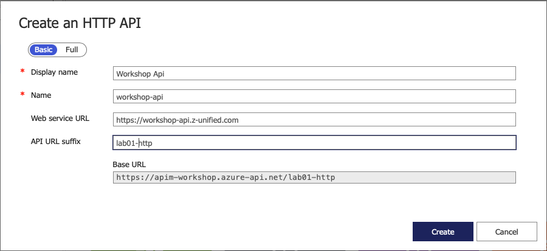
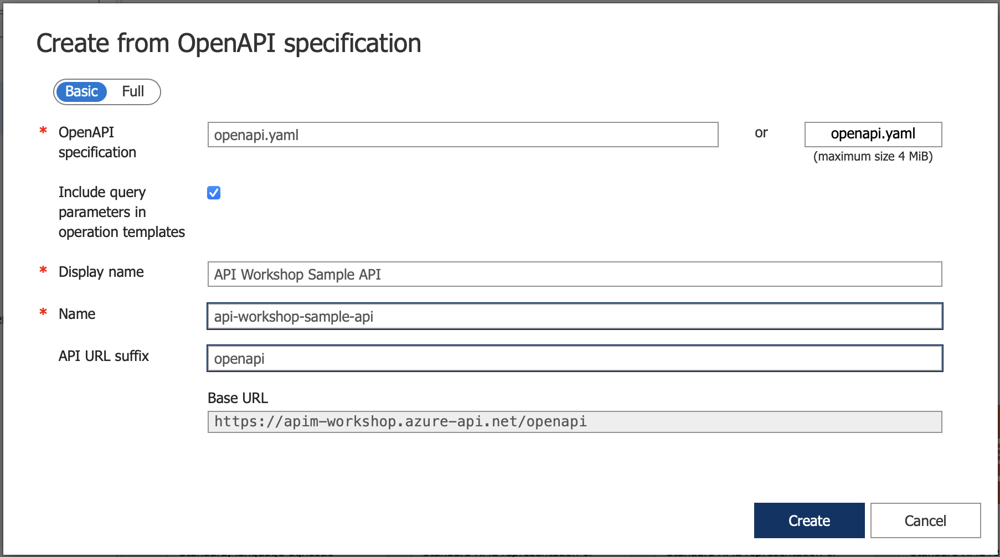
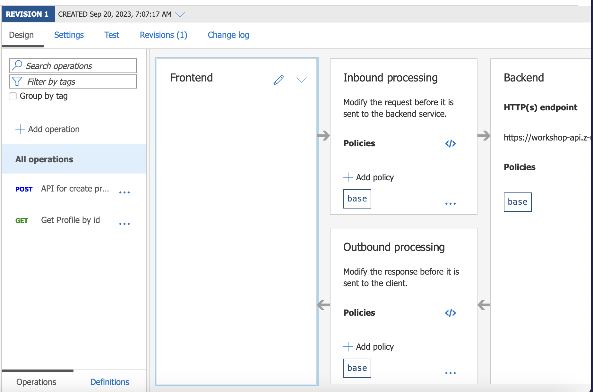

# Lab-01 - Create and Configure API in APIM to associate with backend APIs


## Exercise 1: Explore backend service API
Zeabix has been prepared the backend service API for the workshop, let's explore the backend APIs which will be used in `Lab-01` for backend service

### Create User Profile API
`API Endpoint: https://workshop-api.z-unified.com/profile-service/v1/profiles`

`Method: POST`

`Request Body`
```
{
    "username": "<string>",
    "firstname": "<string>",
    "lastname": "<string>",
    "avatar": "<string>"
}
```

#### Test Create User Profile API
`$ curl -XPOST https://workshop-api.z-unified.com/profile-service/v1/profiles -H 'Content-type: application/json' -d '{"username": "yourusername", "firstname": "YourFirstname", "lastname": "YourLastname", "avatar": "https://placeholder.com/sample.png"}'`

NOTE: You can also use the `Postman` to call this API


### Get User by ID API
`API Endpoint: https://workshop-api.z-unified.com/profile-service/v1/profiles/{id}`

`Method: GET`

#### Test get user profile by ID
`$ curl https://workshop-api.z-unified.com/profile-service/v1/profiles/<your-id>`

## Exercise 2: Manual Create API (HTTP)
- Navigate to Azure Portal, Azure API Management, and select your APIM instance
- Click Menu `API`, then `Add API`
- Select `HTTP`

- Input the API configuration
    + Display Name: `Workshop API`
    + Web service URL: `https://workshop-api.z-unified.com/profile-service`
    + API URL Prefix: `lab01-http`
- Then click Create


### Testing by calling API through APIM
You can call your API through the `Base URL` when you create the API, for example: `https://apim-workshop.azure-api.net/lab01-http`

- Using curl (or Postman) call your first API
```
$ curl https://apim-workshop.azure-api.net/lab01-http/v1/profiles/{id}
```

## Exercise 3: Create API by importing OpenAPI specification
- Create Another API, by `Create from definition`, then select `OpenAPI`
- We will using file `openapi.yaml` in this repository

- Enter configuration
    + API URL Prefix: `openapi`
- Then click Create
- It should create APIs according to the specification in `openapi.yaml` file
