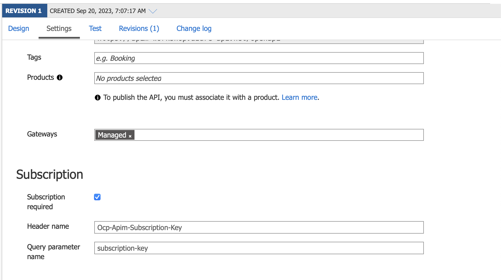
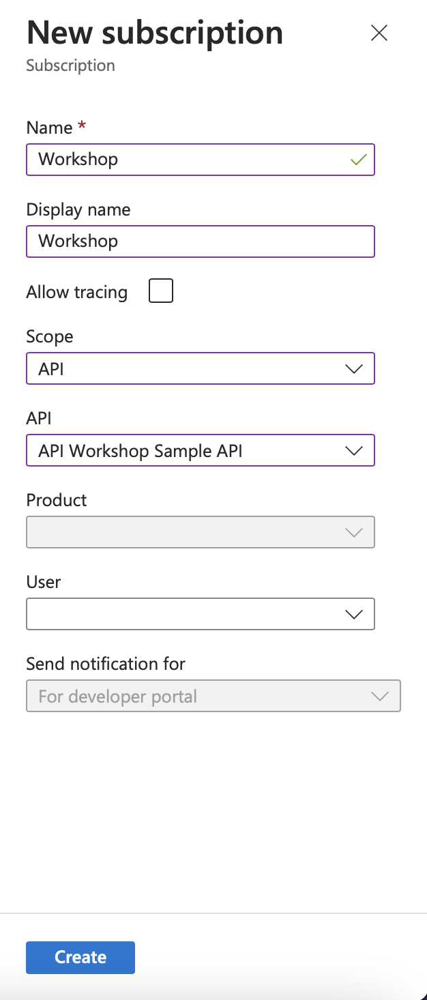

# Lab-02 Protect API by Subscription Key

## Exercise 1 - Configure API to validate the subscription key
Basically, all API that create will be automatically protected by the `Subscription Key`, however if you want to enabled it later, it can be done by

- In Azure API Management, Select your API
- Then select `Settings` tab
- In the section `Suscription`, enabled (or disable) subscription key in this section


The HTTP Header for subscription key can be adjust to suit your requirement, e.g. `X-API-Key`

## Exercise 2 - Create Subscription Key
- In Azure API Management, Select menu `Subscription`, then `add subscription`
- Enter the parameters

- Then click `Create`

## Exercise 3 - Using Subscription Key to consume APIs
- Get the subscription key that you create in exercise 2
- Using curl (or postman) to call the api
```
$ curl https://apim-workshop.azure-api.net/openapi/v1/profiles/2051e1a0-b13d-4a1b-95b4-296fd0a5af0b -H 'Ocp-Apim-Subscription-Key: <your-subscription-key>'
```

- Try to call this api with incorrect subscription key
- Try to call this api without subscription key
- Change header name to `X-API-Key`