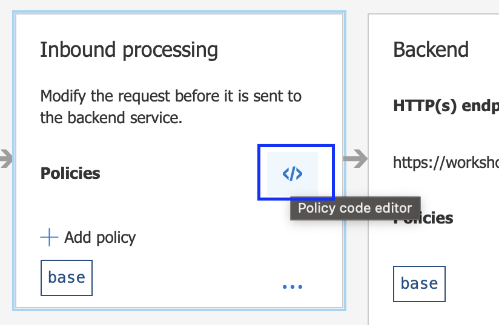

# Lab-03 - APIM Policy

## Exercise 1 - Apply Policy by GUI
- In Azure APIM, select your API and select Operation, if you want the policy to affect all operation, select `All Operations`
- In `Design` tab, `Inbound processing` Section, click `Add policy`
- You can choose to add policy

- Select `cors`
- Enter the configuration

- Then click Save


## Exercise 2 - Apply Policy by code
Even the configuration via GUI is easy to do, but using code is also provide more flexibility and some task can only be done by code.

- Remove the Policy that create from exercise 1
- Click `Policy Code Editor`

- Apply these following policy to your API, then click `Save`
```
<policies>
    <inbound>
        <base />
        <cors allow-credentials="false">
            <allowed-origins>
                <origin>http://localhost:3000</origin>
            </allowed-origins>
            <allowed-methods>
                <method>GET</method>
                <method>POST</method>
                <method>HEAD</method>
                <method>OPTIONS</method>
            </allowed-methods>
            <allowed-headers>
                <header>*</header>
            </allowed-headers>
        </cors>
    </inbound>
    <backend>
        <base />
    </backend>
    <outbound>
        <base />
    </outbound>
    <on-error>
        <base />
    </on-error>
</policies>
```

- Explore the UI, it should reflect the UI as well, so using GUI vs Code is interchangable