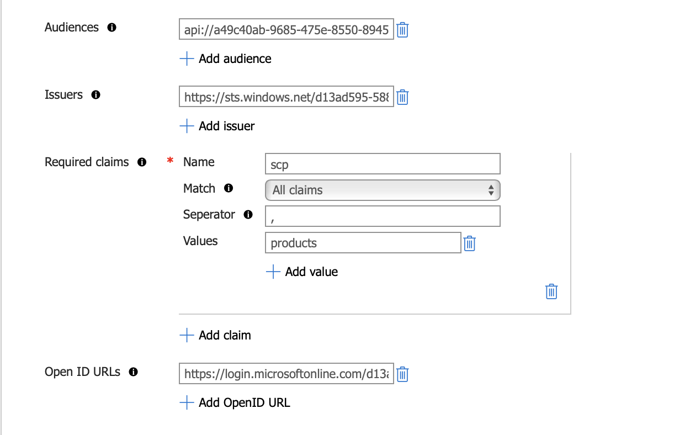

# Lab-04 - OAuth2.0 authentication and authorization

## Introduction to OAuth2.0


## Overall architecture explain


Users will `authenticate` with `Azure AD` through Web application or SPA (Single Page application), The Azure API Management (APIM) will not involve in this process (authentication). However, once the authentication is done, SPA will have the accessToken in JWT format, which contains various claims.

The `APIM` with proper policy configured will be able to use those `claims` to do the `authorization` process and make decision whether or not it should forward the request to upstream service

Upstream (or backend services) can be running in any runtimes, e.g. `Azure App Service`, `AKS`, or just simple `Virtual Machine`

#### Consideration
1. With this architecture, we can offload `Authentication/Authorization` out of the application, However, it's important to protect the upstream/backend service in the network layer. Which mean there is only one way to access those services which is through the APIM

2. In real-world, always consider to add another layer of security in front of `Azure APIM`, it's recommended to place the Web Application Firewall (WAF) such as, `Azure Frontdoor` in front of `Azure API Management`, so that it can help to protect against other threats, such as DDos, etc.


## Exercise 1 - Configure Azure AD
- Login to Azure Portal and navigate to `Azure Active Drirectory`
- Click `App Registration` on the menu


- Click `+ Add` button


- Enter application name, for example `workshop-web-app`
- Select `Accounts in this organization directory only`
- In `Redirect URI`, select platform to `Single-page application(SPA)` and redirect uri to `http://localhost:3000/`
- Then click `Register`
- When your application successfully registered, copy the `Application (Client) ID`, this value will be used to configure your SPA in `Exercise 2`


- Next we will add API permission to our SPA app, by click `API permissions` on the menu
- Click `Add permission`, Select `Microsoft Graph`, then select `delegated permissions`
- Select `offline_access` and `openid` permissions, then click `Add permissions`


- Get Tenant ID from the `Overview` page of your `Azure AD`, this value will be used to configuring SPA in `Exercise 2`


- You're set!!!

## Exercise 2 - Setup frontend application (SPA)
Zeabix has prepare simple React Application (SPA) for this workshop, let's configure it to authenticate with your Azure AD

- Clone the GitHub repository https://github.com/zeabix-cloud-native/workshop-web-app.git

- Open and Edit file `src/authConfig.js`
```js
auth: {
        clientId: '<your Application (Client) ID', // This is the ONLY mandatory field that you need to supply.
        authority: 'https://login.microsoftonline.com/<your Tenant ID>/', // Replace the placeholder with your tenant subdomain 
        redirectUri: '/', // Points to window.location.origin. You must register this URI on Azure Portal/App Registration.
        postLogoutRedirectUri: '/', // Indicates the page to navigate after logout.
        navigateToLoginRequestUrl: false, // If "true", will navigate back to the original request location before processing the auth code response.
    },
```

- Update `clientId` to your `Application (client) ID`
- Update `authority`, replace `<your Tenant ID>` with your tenant ID
- Run command `npm install` to download dependencies libraries
- Start Application by run command `npm start`
- You can access this SPA using any web browser, e.g. chrome and navigate to `http://localhost:3000`


## Exercise 3 - Examine the Token from Azure AD
- Start SPA application, and use the browser navigate to `http://localhost:3000`
- Click `Login with Azure AD`
- The login form will popup, then enter your credential to authenticate with Azure AD
- When successfully login with Azure AD, on the menu of SPA application click `Token Inspector`
- Analys the token returned from Azure AD, it will have various claims, we will go through some of the claims that we will used


## Exercise 4 - Implement APIM Policy to Validate JWT Token
After our frontend SPA application is able to authenticate with `Azure AD` and able to retrive the token. To make the authorization process work, generally the frontend SPA application needs to send the token in the HTTP Header `Authorization: Bearer <token>` to every API requests, and the token will be picked up by `Azure APIM` which will examine and validate the token which we will implement that logic in this exercise


### Register APIM as one of the Application via Azure AD
In order to govern our API more efficiently, it's recommended to register the APIM as one of the Application in Azure AD, so that we can treat it like a protected resource, which we can grant the scope to each clients.

- Open Azure Portal and navigate to `Azure Active Directory`, then click `App Registration` without `Redirect URL (optional)`


- After successfully register APIM as an application in AD, Click `Expose API` menu, and click Add `Application ID URI`, then click `Save`


- Then Add scope name `Products`

, and enter the Admin consent display name and description, then click `Save`

- Then `Add a client application`, Then copy the `Application (Client) ID` of the SPA that we register earlier, then check the `Authorized scopes`

- Copy the scope name, which will be used to update the SPA source code


### Update scopes to SPA source code
In the `loginRequest` of the SPA, we need to specify the scopes that we want to use, in this case the scope is what we've just created in AD `api://<id>/products`

- Use text editor, open the source code of SPA `./src/authConfig.js`

```js
/**
 * Scopes you add here will be prompted for user consent during sign-in.
 * By default, MSAL.js will add OIDC scopes (openid, profile, email) to any login request.
 * For more information about OIDC scopes, visit: 
 * https://docs.microsoft.com/en-us/azure/active-directory/develop/v2-permissions-and-consent#openid-connect-scopes
 */
export const loginRequest = {
    scopes: ["api://a49c40ab-9685-475e-8550-8945a36a05fe/products"],
};
```

- Then save the file, it should be automatically restart the SPA application

---
At this point, we should be ready to authenticate with Azure AD for the SPA

- Click `Login with Azure AD` button, it should popup the authentication windows


- Login
- Examine the token return from Azure AD, Compare with the Exercise 3


### Configure Azure APIM
- Open Azure Portal and navigate to Azure API Management
- Create API name `Product API` (using HTTP)


- Add Operation `List Products`
  + Display Name: `List Products`
  + Name: `list-products`
  + URL (Method): `GET`
  + URL: `/v1/products`


- In `Settings` menu, Disable `Subscription required`


- Click `All Operations`, click add `Policy`, select `cors`

  + Allowed Origins: `http://localhost:3000`
  + Allowed methods: `GET, POST, OPTIONS, HEAD`
  + Allowed headers: `*`


- Click `All Operations`, click add `Policy`, select `Validate JWT`


- Configure JWT validation


  + Validate by: `Header`
  + Header name: `Authorization`
  + Required expiration time: `Yes`
  + Required signed tokens: `Yes`
  + Required scheme: `Bearer`
  + Click skew (in seconds): `10` (or any number)
  + Audiences: value in claim name `aud`
  + Issuers: value in claim name `iss`
  + Required claim (name): `scp`
  + Required claim (Match): `All claims`
  + Required claim (Separator): ` ` (space)
  + Required claim (Values): `products`
  + Open ID URLs: Get this url from Azure AD overview page, menu `Endpoints`

- Then click `Save`


### Configure API endpoint in SPA sourcecode
At this point the APIM is ready for serve the API to SPA, however, it's required to be configured to connect to the API end point

- Use text editor open file `.env`
- Update `REACT_APP_PRODUCT_API_ENDPOINT` value to your Product API endpoint

Example: 
```
REACT_APP_PRODUCT_API_ENDPOINT=https://apim-workshop.azure-api.net/product-service
```

- Save and restart the SPA


## Exercise 5 - Testing

- Login SPA with Azure AD
- On the menu, navigate to `Products` 
- SPA should be able to retrive all product items from the API


- Use `curl` command to request for the list of products API, without token, and see the result
  ```
  $ curl https://<apim-url>/profile-service/v1/profiles
  ```
- Use `curl` command to request for the list of products API, with invalid token, and see the result
```
$ curl https://<apim-url>/profile-service/v1/profiles -H 'Authorization: Bearer invalidtoken'
```