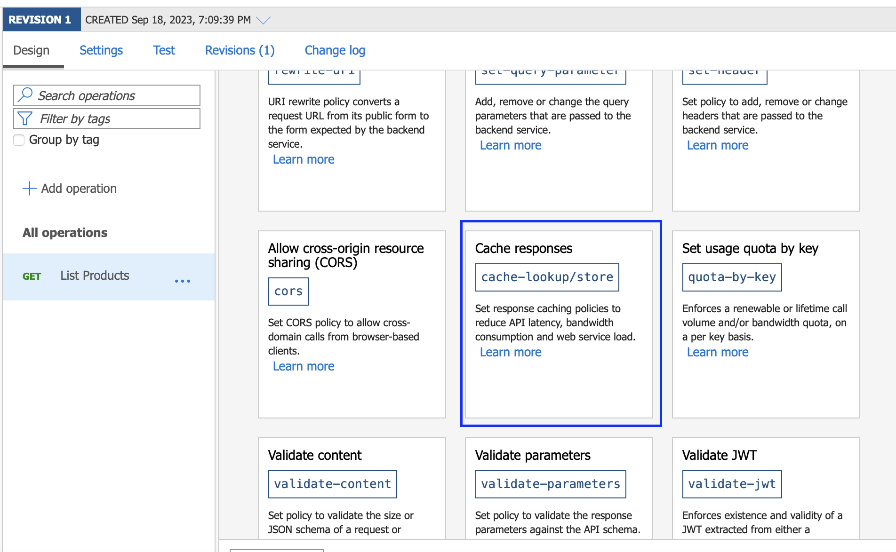
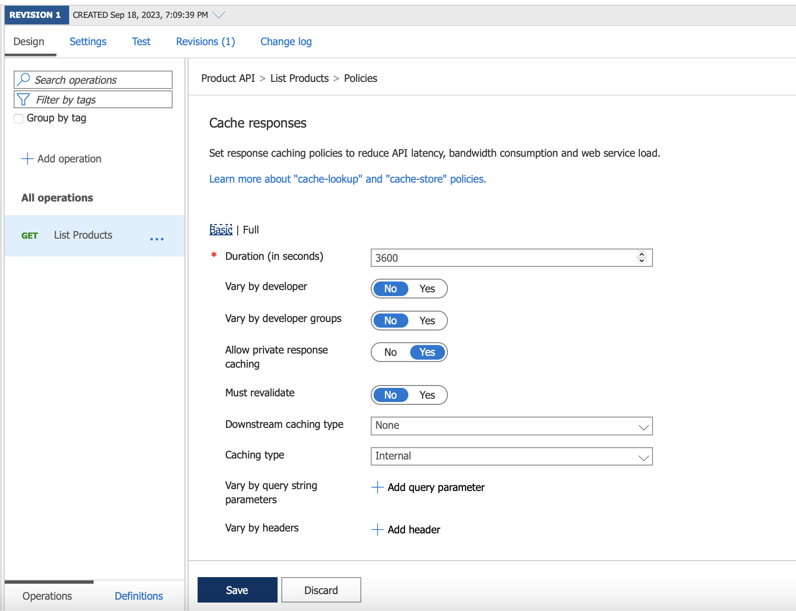
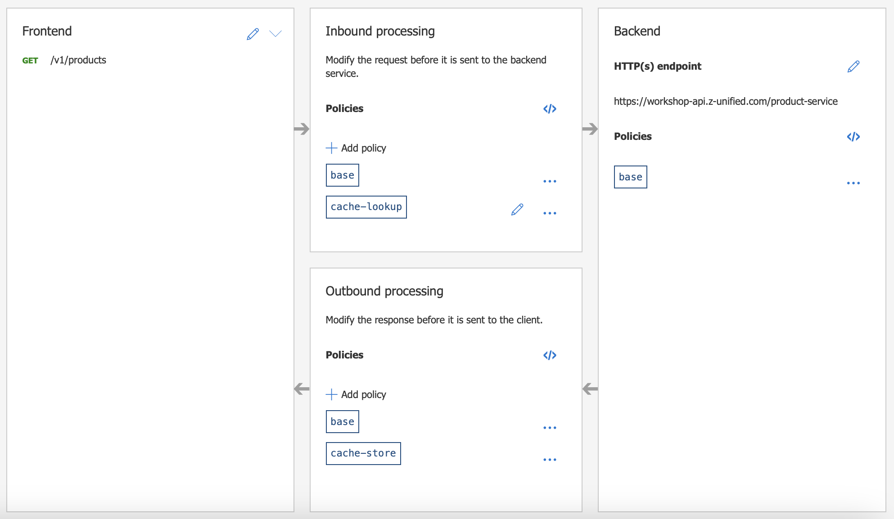

# Lab-05 - API caching

In `Lab-04`, we successfully protected the `Product API` with `OAuth2.0`, However, we can notice that the API is quite slow (the upstream service, has simulated the latecy). In the real-world, some APIs are quite resource intensive and expensive to access, for example it may need to query to DB with millions of records in DB, which cause the latency.

However, some of the response we can cache it in the API Gateway layer, so that it can reduce the load that will go to the upstream service and also improve the user experiences

### Enable (Internal) Cache
- In `Product API`, Click Operation `List Products` and add policy
- Select `Cache Responses`

- Configure the policy

  + Duration (in seconds): e.g. `3600` (but can experiment with other number)
  + Vary by developer: `No`
  + Vary by developer group: `No`
  + Allow private response: `Yes`
  + Must validate: `No`
  + Caching type: `Internal`
- Then click `Save`, you should see `cache-lookup` policy at `Inbound processing`, and `cache-store` at `Outbound processing`

### Testing
- In SPA, Page `Products`, click refresh button multiple times, and compare the response time to see if it's faster or not
- Recommend to open `Inspection` from your browser to see the exact time usage to call the `List Product API`

