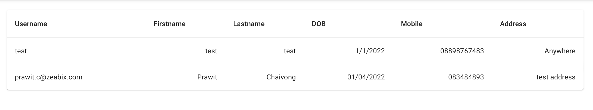

# Lab 07 - Broken Function Level Authorization

Some of the application have many types of user to access and use application, However, they have the difference roles and should have access differently depends on the role that they have.

The `Broken Function Level Authorization` is when the API lack of the security control. For example, the normal user can call API which is intended for `admin` roles

In this lab we will set up `Azure AD` and `Azure APIM` to control the security of the API in the function level

*Scenario: Our product team decided to add another feature to the SPA and this feature should be accessed by only some users which has `admin` roles*

For example



### Exercise 1 - Create App Roles in Azure AD for our Application
- Open Azure Portal and navigate to `Azure AD`
- On `App Registration`, select the application that we created for Azure APIM
- Click `App roles` on the menu, and click `Create app role`
    + Display Name: `Admin`
    + Allowed member type: `Users/Groups`
    + Value: `admin`
    + Description: `Admin role for workshop app`
- Then Click `Apply`

Next we will assign this app roles, to ourselve for testing
- On `Enterprise application`, click `Users and Groups`, then click `Add user/group`, then Add our user and assign this role


### Exercise 2 - Examine the token
- In SPA, Logout and Login again
- Inspect the token, then copy it to decode by `jwt.io`
- You should be able to see claims name `roles` with values `[ "admin" ]`

### Exercise 3 - Configure APIM 
- Create new API called `Admin API`
- Apply the following policy to the `All Operations`, ensure that you change the `audiences`
```
<policies>
    <inbound>
        <base />
        <validate-jwt header-name="Authorization" failed-validation-httpcode="401" require-expiration-time="true" require-scheme="Bearer" require-signed-tokens="true" clock-skew="10" output-token-variable-name="jwt">
            <openid-config url="https://login.microsoftonline.com/d13ad595-5883-4b3a-a953-bc0f981c0c35/v2.0/.well-known/openid-configuration" />
            <audiences>
                <audience>api://a49c40ab-9685-475e-8550-8945a36a05fe</audience>
            </audiences>
            <issuers>
                <issuer>https://sts.windows.net/d13ad595-5883-4b3a-a953-bc0f981c0c35/</issuer>
            </issuers>
            <required-claims>
                <claim name="scp" match="all" separator=" ">
                    <value>profiles</value>
                </claim>
                <claim name="roles" match="all" separator=" ">
                    <value>admin</value>
                </claim>
            </required-claims>
        </validate-jwt>
        <cors allow-credentials="false">
            <allowed-origins>
                <origin>*</origin>
            </allowed-origins>
            <allowed-methods>
                <method>*</method>
            </allowed-methods>
            <allowed-headers>
                <header>*</header>
            </allowed-headers>
        </cors>
    </inbound>
    <backend>
        <base />
    </backend>
    <outbound>
        <base />
    </outbound>
    <on-error>
        <base />
    </on-error>
</policies>
```
- Add Operation `List User Profile`
  + Method: `GET`
  + URL: `/v2/profiles`

- Test and Save API


### Exercise 4 - Setup SPA
- Reconfigure SPA by edit file `.env`
- Update this configuration to your APIM endpoint
```
REACT_APP_ADMIN_API_ENDPOINT=https://apim-workshop.azure-api.net/admin
```
- Save and restart SPA
- Login with Azure AD, then navigate to `Admin Page`
- You should see list of all users available in the system

### Exercise 5 - Remove Role assignment 
- Go to Azure AD and then `Enterprise application`, `Users and Groups`
- Remove user assignment
- Re-login to SPA again
- It should not be able to get the list of the users
- Examine the access token, see if there is still the claim `roles` or not