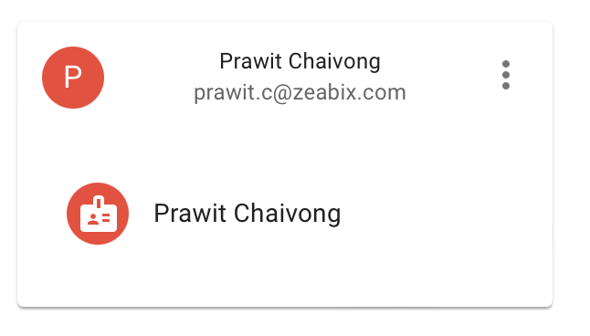

# Lab-08 Response filtering

When we create reusable API (as a platform), the common problem that we found is that
each client use the data in the different way which depends on the business use-case.

We likely to find that in some cases, backend send data to frontend more than frontend needs
on `just-in-case` basis.

However, this practice is considered as a vulnerability, which we called `Excessive Data Exposure`, which means the backend 
provide data more than frontend needs and rely on the implementation logic of the frontend to `hide` those data.

However, the instruders does not rely on the frontend, most of the time they just invoke API directly, which will cause the data leaks

### Exercise 1 - Examine the problem

- Open Browser, navigate to SPA application at `http://localhost:3000`
- Login with Azure AD
- On the Menu, click `Summary Profile`

- Let's set the scenario here, assume that if the client application, only some fields of the data e.g. `username`, `firstname` and `lastname`
- Open the inspection in your browser to examine the data return from this API
```json
{
    "username": "prawit.c@zeabix.com",
    "firstname": "Prawit",
    "lastname": "Chaivong",
    "avatar": "",
    "dob": "17/04/2022",
    "mobile": "asdfasdf",
    "address": "asdfasdf",
    "oid": "7239211d-39e0-40aa-b6f9-47e480088a87",
    "id": "f3893445-6dd6-43c1-8871-561a29715e6b"
}
```
- We can see a lot of fields return from this API to the frontend, most of them is discarded. However, some of those data considered to be a PII (Personal identifiable information)

### Exercise 2 - Implement solution (response filtering)
- In Azure Portal, Azure APIM
- On `Profile API` (from earlier labs), Add Operation name `Get Profile Summary`
  + Method: `GET`
  + URL: `/v2/profiles/summary`
- Apply these following policy, in the Operation `Get Profile Summary`
```
<policies>
    <inbound>
        <base />
        <rewrite-uri template="@{
            String oid = ((Jwt)context.Variables["jwt"]).Claims["oid"][0];
            return $"/v2/profiles/{oid}";
        }" copy-unmatched-params="true" />
        <set-header name="Accept-Encoding" exists-action="override">
            <value>gzip,deflate</value>
        </set-header>
    </inbound>
    <backend>
        <base />
    </backend>
    <outbound>
        <base />
        <choose>
            <when condition="@(context.Response.StatusCode == 200)">
                <return-response>
                    <set-status code="200" reason="success" />
                    <set-body>@{
                        JObject profile = context.Response.Body.As<JObject>();
                        profile.Remove("oid");
                        profile.Remove("email");
                        profile.Remove("avatar");
                        profile.Remove("dob");
                        profile.Remove("mobile");
                        profile.Remove("address");
                        return profile.ToString(); 
                    }</set-body>
                </return-response>
            </when>
            <otherwise />
        </choose>
    </outbound>
    <on-error>
        <base />
    </on-error>
</policies>
```

- Test and Save your API

### Exercise 3 - Reconfiguring the SPA web
- With your text editor, open `.env` file and edit this configuration
```
REACT_APP_SUMMARY_PROFILE_PATH=/v2/profiles/summary
```
- Restart SPA Application, by `npm start`
- Go to menu `Profile Summary`
- Inspect the browser to see the console log, examine the data return back from your new API


### Exercise 4 - Code walkthrough

- Inbound
```
<inbound>
  <base />
  <rewrite-uri template="@{
    String oid = ((Jwt)context.Variables["jwt"]).Claims["oid"][0];
    return $"/v2/profiles/{oid}";
  }" copy-unmatched-params="true" />

  <set-header name="Accept-Encoding" exists-action="override">
      <value>gzip,deflate</value>
  </set-header>
</inbound>
```

We extract the `oid` value from JWT token and then rewrite uri to backend service as `/v2/profiles/{oid}`

Next is an optional, is to overide the `Accept-Encoding` header to limit it just only `gzip, deflate` (If your backend service support `br` encoding, you do not need this part)

- Outbound (filter the response)
```
<outbound>
        <base />
        <choose>
            <when condition="@(context.Response.StatusCode == 200)">
                <return-response>
                    <set-status code="200" reason="success" />
                    <set-body>@{
                        JObject profile = context.Response.Body.As<JObject>();
                        profile.Remove("oid");
                        profile.Remove("email");
                        profile.Remove("avatar");
                        profile.Remove("dob");
                        profile.Remove("mobile");
                        profile.Remove("address");
                        return profile.ToString(); 
                    }</set-body>
                </return-response>
            </when>
            <otherwise />
        </choose>
</outbound>
```

If the response is successfull (StatusCode == 200), we continue to modify/filter the data, by read it to `JObject` and then remove the key from it.

The keys that we have not removed will be the data that we return to client.

