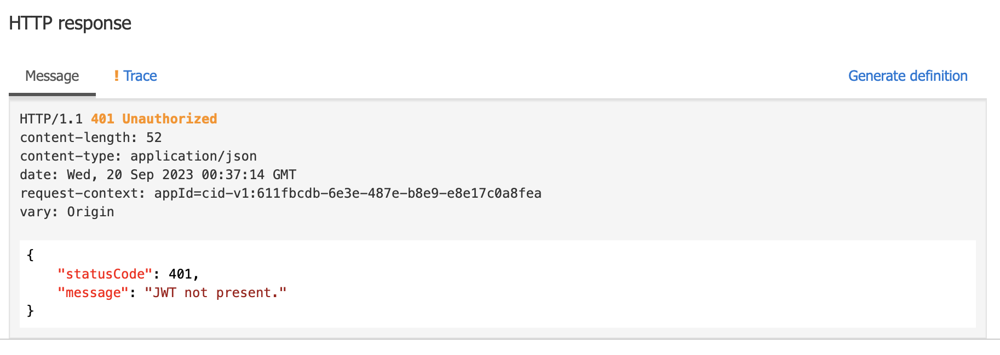
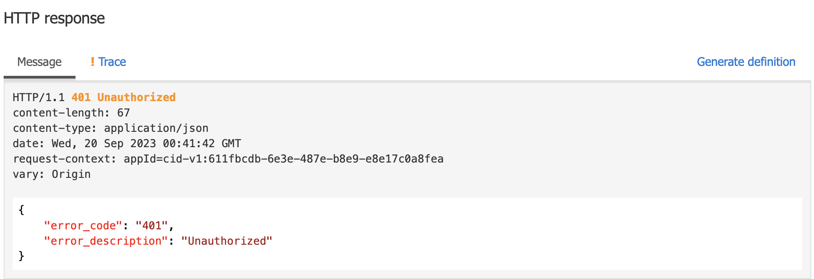

# Lab-08 Transformation

In some cases we have to transform the request or response of the API 
For example, if our backend services have the error code too many pattern, we can standardize them in to one specification. In this lab we will transform the error code into the our standard format

### Exercise 1 - Transform Error Code
- In `Product API`, To to `Test` tab and execute the test without JWT token
- It should return something like this


- let's assume that our company has error standard as following format
```
{
    "error_code": "xxx",
    "error_description": "error message"
}
```

- In `All Operations`, apply this part of the policy into the `<on-error></on-error>`

```
<on-error>
    <base />
        <choose>
            <when condition="@(context.Response.StatusCode == 401)">
                <set-body template="none">@{
                    JObject error = new JObject();
                    error.Add(new JProperty("error_code", "401"));
                    error.Add(new JProperty("error_description", "Unauthorized"));
                    return error.ToString();
                }</set-body>
            </when>
            <otherwise />
        </choose>
</on-error>
```

- Test it again, the result should be similar to this


### Exercise 2 - Transform Request
We have already done request tronsformation in lab 6, but let's revisit the code 
```
<policies>
    <inbound>
        <base />
        <set-body>@{
            JObject reqBody = context.Request.Body.As<JObject>(true);
            String firstname = ((Jwt)context.Variables["jwt"]).Claims["given_name"][0];
            String lastname = ((Jwt)context.Variables["jwt"]).Claims["family_name"][0];
            String oid = ((Jwt)context.Variables["jwt"]).Claims["oid"][0];
            String email = ((Jwt)context.Variables["jwt"]).Claims["email"][0];

            reqBody["oid"] = oid;
            reqBody["firstname"] = firstname;
            reqBody["lastname"] = lastname;
            reqBody["username"] = email;

            return reqBody.ToString();
        }</set-body>
    </inbound>
    <backend>
        <base />
    </backend>
    <outbound>
        <base />
    </outbound>
    <on-error>
        <base />
    </on-error>
</policies>
```
