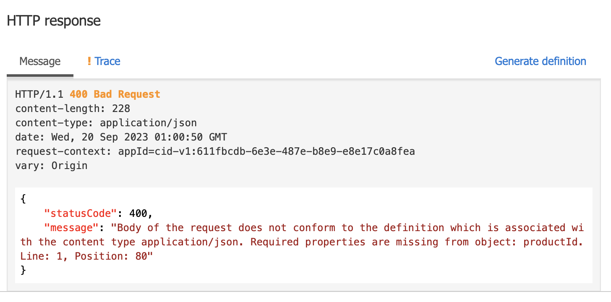

# Lab-09 - Validate Request
Azure APIM can help to validate the incoming request before pass it to the backend service, this will increase the API security. In this lab we will learn how to use APIM to validate the incoming request

### Exercise 1 - Create Schema
- In Azure APIM Portal, select "schema" menu
- Create `CreateProfile` schema, and copy these following JSON schema to it, then Click `Save`

```
{
  "$schema": "https://json-schema.org/draft/2020-12/schema",
  "$id": "https://example.com/product.schema.json",
  "title": "Profile",
  "description": "a create profile request",
  "type": "object",
  "properties": {
    "firstname": {
      "description": "Firstname",
      "type": "string"
    },
     "lastname": {
      "description": "Lastname",
      "type": "string"
    },
     "avatar": {
      "description": "URL avatar image",
      "type": "string"
    },
     "username": {
      "description": "Username",
      "type": "string"
    }
  },
  "required": [
    "firstname",
    "lastname",
    "username"
  ]
}
```

### Exercise 2 - Configure API Policy
- Using API `API Workshop Sample API` that we've created from openapi
- Select `API for create profile` then add these following policy, ensure that the `schema-id` match your schema name from exercise 1
```
<policies>
    <inbound>
        <base />
        <validate-content unspecified-content-type-action="ignore" max-size="128" size-exceeded-action="ignore" errors-variable-name="validationError">
            <content type="application/json" validate-as="json" action="prevent" schema-id="CreateProfile" />
        </validate-content>
    </inbound>
    <backend>
        <base />
    </backend>
    <outbound>
        <base />
    </outbound>
    <on-error>
        <base />
    </on-error>
</policies>
```

### Exercise 3 - Testing
- Test the API by using the correct schema, you should be able to create profile
- Test again by remove some mandatory fields, e.g. `firstname`, `lastname`, `username` from the request body, you should see this error
