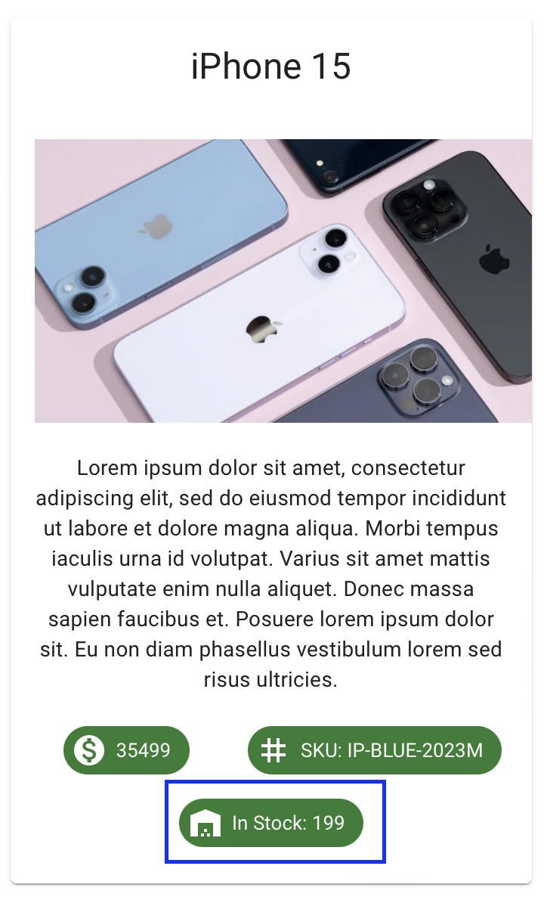
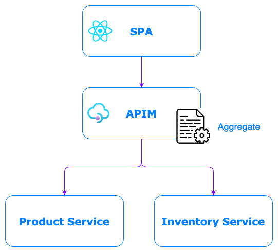

# Lab-11 Aggregation pattern

Let's assume that our company need to upgrade the  SPA web by improving the `Product` UI to have `item in stock` in the `Product` card, like this



However, the data of the number of item left in stock/inventory is not in the `product-service`, instead it's controlled by another service name `inventory-service` This is common for microservice archicture.


### Exercise 1 - Discuss about aggregration solution
With Azure APIM, we can introduce the solution, called `Aggregation Pattern` implemented at APIM level instead of backend service.




### Exercise 2 - Implementation
- In the `Product API`, add another operation named `Get Product`
  + Method: `GET`
  + URL: `/v1/profiles/{id}`

- Then apply this following policy to the `Get Product` operation
```
<policies>
    <inbound>
        <base />
        <set-header name="Accept-Encoding" exists-action="override">
            <value>gzip, deflate</value>
        </set-header>
    </inbound>
    <backend>
        <base />
    </backend>
    <outbound>
        <base />
        <choose>
            <when condition="@(context.Response.StatusCode == 200)">
                <send-request mode="new" response-variable-name="inventory" timeout="60" ignore-error="true">
                    <set-url>@{
                        var id = context.Request.MatchedParameters["id"];
                        return $"https://workshop-api.z-unified.com/inventory-service/v1/inventories/{id}";
                    }</set-url>
                    <set-method>GET</set-method>
                    <set-body />
                </send-request>
                <return-response>
                    <set-status code="200" reason="success" />
                    <set-header name="Content-type" exists-action="override">
                        <value>application/json</value>
                    </set-header>
                    <set-body>@{
                        JObject inv = ((IResponse)context.Variables["inventory"]).Body.As<JObject>();
                        JObject product = context.Response.Body.As<JObject>();
                        product.Add(new JProperty("stock", inv["amount"]));

                        return product.ToString();
                    }</set-body>
                </return-response>
            </when>
            <otherwise />
        </choose>
    </outbound>
    <on-error>
        <base />
    </on-error>
</policies>
```

- Test and Save API


### Exercise 3 - Test with SPA
- Open SPA and login with Azure AD
- Navigate to menu `Product with Stock`, you should see the Product UI with `stock` information
- Inspect the browser network to see the response, you should see something like this
```json
{
  "id": "8d3c59f8-371b-4753-8333-db714922203f",
  "name": "iPhone 15",
  "description": "Lorem ipsum dolor sit amet, consectetur adipiscing elit, sed do eiusmod tempor incididunt ut labore et dolore magna aliqua. Morbi tempus iaculis urna id volutpat. Varius sit amet mattis vulputate enim nulla aliquet. Donec massa sapien faucibus et. Posuere lorem ipsum dolor sit. Eu non diam phasellus vestibulum lorem sed risus ultricies.",
  "sku": "IP-BLUE-2023M",
  "price": 35499,
  "image": "https://cdn.thewirecutter.com/wp-content/media/2022/10/whichiphone-2048px-2681-2x1-1.jpg?auto=webp&quality=75&crop=2:1&width=1024&dpr=2",
  "stock": 199
}
```


### Exercise 4 - Code walk-through
Let's us walk-through the policy code!!!